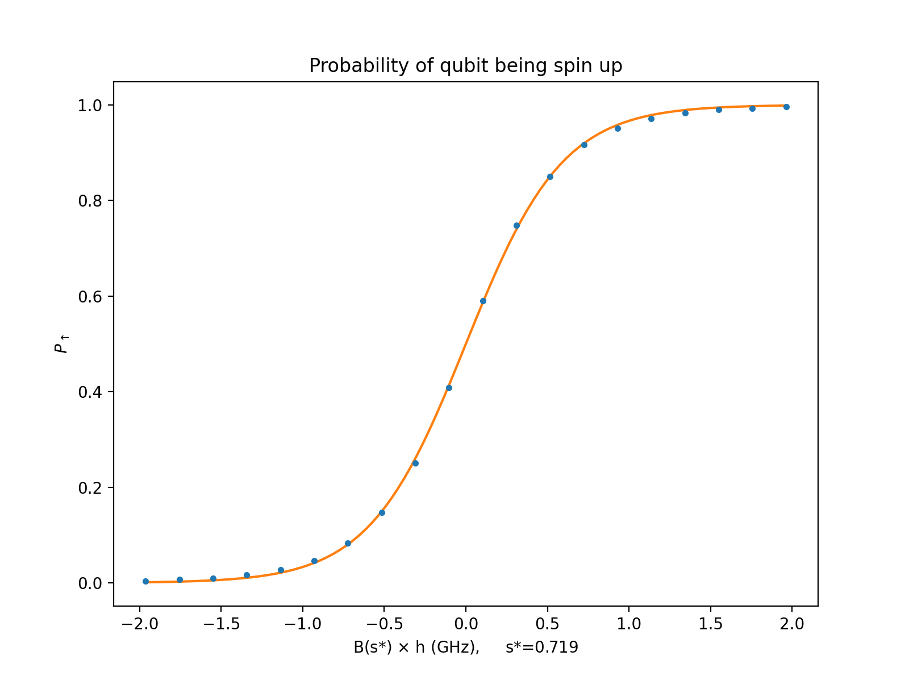

# Dwave2000q

DISCLAMER:
this code is still in development and far from finished.
For any problem open an issue or email directly the author.
If you want to contribute see the [Contributing](#contributing) section below.

This project gathers the code I'm using for
my masther thesis on quantum computing.

The goal is to understand and better describe
the thermalization process of a quantum annealer,
a D-Wave QPU made of superconducting qubits
([https://www.dwavesys.com](https://www.dwavesys.com)).

All the experiments so far run through Leap
cloud service. The code is based on the D-Wave
Ocean Software, documentation available
[here](https://docs.ocean.dwavesys.com/en/latest/index.html).

## Getting started
Steps to set up your project locally

### Prerequisites
- Python 3

### Installation
1. Clone this repo on your computer
   ```bash
   $ git clone https://github.com/federicovisintini/Dwave2000q.git
   ```

2. (optional) Create a virtual enviroment
   ```bash
   $ cd Dwave2000q
   $ python3 -m venv myvenv
   ```
   and activate it
   ```bash
   $ source myvenv/bin/activate
   ```
   N.B. the virtual enviroment should be activated every time

3. Install the requirements
   ```bash
   $ pip install -r requirements.txt
   ```

4. (recommended) Set up the D-Wave environment
   following the official documentation [here](https://docs.ocean.dwavesys.com/en/stable/overview/install.html#set-up-your-environment).

5. Create a [Leap](https://cloud.dwavesys.com/leap/login/?next=/leap/)
   account to have access to D-Wave QPUs.
   
6. Configure Access to D-Wave Solvers connect to your Leap account
   using the D-Wave’s Solver API (SAPI), documentation available
   [here](https://docs.ocean.dwavesys.com/en/stable/overview/sapi.html#sapi-access).
   
## Usage
Description of the notebook and scripts in the `code/` folder.

Code which uses QPU time is commented so whole scrips / notebooks
can be run whithout worrying. Code which takes a long time to execute
is decleared in comments / md.

To run the notebooks (*_.ipynb_) you will need to use jupyter;
open the terminal (activate the venv if you created it) and type:
```bash
$ jupyter notebook
```

#### Single qubit temperature (*python notebook*)
This first notebook introduces the machine hamiltonian,
plotting the annealing functions *A(s)* and *B(s)*.

We try to evaluate the thermalisazion of a single qubit
in two different methods:

1. We let the spin evolve in the idling channel in the final 
   state of the annealling, or said another way
   we initialise the spin in the first excited state and let it decay
   (this method fails);
   
2. Taking inspiration from the official documentation 
   we measure the temperature assuming classical Boltzamnn distribution
   as final state (good result but using perhabs an oversimplifing assumption)
   
   
Finally, we inquire the presence of entanglement for some two-qubit state
that could be created in the machine.

#### Analitic model (*python notebook*)
In this notebook we focus our effort to find a microscopic model
that can describe the spin-enviroment interaction through
a Lindblad Master Equation.


A Python script has been introduced to parallelise and speed up
computation.
We introduce also QuTiP a python module to simulate quantum systems.

We then start focusing on the two-qubit thermalization,
performing an experiment and numerically computing the concurrece
(entanglement measure) at all points during the annealling.


#### Two temperature simulation / plot (*python scripts*)
First thing we convert the result of two-qubit experiment to a more usable
form using *2_save_results.py*

Then we focus on generalizing the single spin Lindblad Master Equation
to a general case of n-qubits interacting, in *2_two_temperature_simulation.py*.

Finally, the script *2_two_temperatures_simulation.py* plot said results.


## References
This work takes inspiration from:
- Authors: Tameem Albash and Jeffrey Marshall  
  Title: “Comparing Relaxation Mechanisms in Quantum and Classical Transverse-Field Annealing”  
  In: Phys. Rev. Applied 15 (Jan. 2021), p. 014029  
  DOI: [10.1103/PhysRevApplied.15.014029](https://doi.org/10.1103/PhysRevApplied.15.014029)
    
- Authors: Lorenzo Buffoni and Michele Campisi  
  Title: "Thermodynamics of a quantum annealer"  
  In: IOP Publishing, Quantum Science and Technology 5 (Jun. 2020), p. 035013  
  DOI: [10.1088/2058-9565/ab9755](https://doi.org/10.1088/2058-9565/ab9755)
  
- Authors: Jeffrey Marshall et al.  
  Title: “Power of Pausing: Advancing Understanding of Thermalization in Experimental Quantum Annealers”  
  In: Phys. Rev. Applied 11 (Apr. 2019), p. 044083  
  DOI: [10.1103/PhysRevApplied.11.044083](https://doi.org/10.1103/PhysRevApplied.11.044083)  

- Authors: Tameem Albash et al.  
  Title: “Quantum adiabatic Markovian master equations”  
  In: New Journal of Physics 14.12 (Dec. 2012), p. 123016  
  DOI: [10.1088/1367-2630/14/12/123016](https://doi.org/10.1088/1367-2630/14/12/123016)
  
## Acknowledgments
I would like to thank my thesis advisors *Vittorio Giovannetti* and *Michele Campisi*
for the guidance and motivation through this project.

## Contributing
Pull requests are welcome.

For major changes, please open an issue first to discuss what you would like to change.

## License
Distributed under the GNU GPLv3 by Federico Visintini.

See `LICENSE` for more information.
